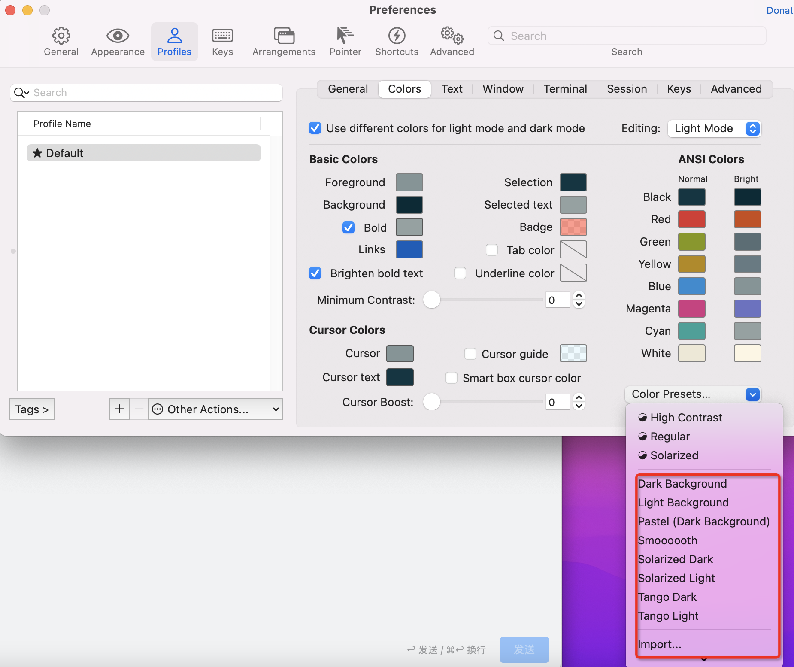
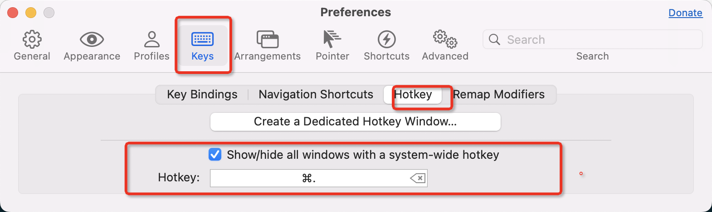

# ⚙️ Mac基础依赖
## Homebrew 包管理工具
1. <a ref="/bin/bash -c "$(curl -fsSL https://raw.githubusercontent.com/Homebrew/install/HEAD/install.sh)"">安装</a>(如果 安装不了 直接通过​/bin/zsh -c "$(curl -fsSL https://gitee.com/cunkai/HomebrewCN/raw/master/Homebrew.sh)" 国内镜像安装)
2. 配置镜像 
```# brew设置清华镜像源：
echo '# brew设置清华镜像源：\nexport HOMEBREW_API_DOMAIN="https://mirrors.tuna.tsinghua.edu.cn/homebrew-bottles/api"\nexport HOMEBREW_BOTTLE_DOMAIN="https://mirrors.tuna.tsinghua.edu.cn/homebrew-bottles"\nexport HOMEBREW_BREW_GIT_REMOTE="https://mirrors.tuna.tsinghua.edu.cn/git/homebrew/brew.git"\nexport HOMEBREW_CORE_GIT_REMOTE="https://mirrors.tuna.tsinghua.edu.cn/git/homebrew/homebrew-core.git"\nexport HOMEBREW_PIP_INDEX_URL="https://pypi.tuna.tsinghua.edu.cn/simple"\n# brew设置清华镜像源\n' >> ~/.zshrc
```
3. homebrew 禁用自动升级   export HOMEBREW_NO_AUTO_UPDATE=1
4. homebrew 设置bin 
```
export PATH="/opt/homebrew/bin:$PATH"
export PATH="/opt/homebrew/sbin:$PATH"
```
5. homebrew 安装旧版本依赖-例如maven3.2.1
```
用 Homebrew 从历史提取旧版公式
新建自有 tap 并提取指定版本
1. brew tap-new $USER/old-maven
2. brew extract --version=3.2.1 maven $USER/old-maven
3. brew install $USER/old-maven/maven@3.2.1
4. 若 --version 未命中，可按历史提交提取：
    a. 找到 homebrew-core(https://formulae.brew.sh/ 搜索maven 进入github，查看历史，找到3.2.5版本) 中旧版maven的提交 SHA 后执行：brew extract maven $USER/old-maven --revision=<commit sha>;然后brew install $USER/old-maven/maven@3.2.1
5. 删除自建的tap
    a. brew untap ${tap}
```

## vim设置
```
" Configuration file for vim
set modelines=0" CVE-2007-2438

" Normally we use vim-extensions. If you want true vi-compatibility
" remove change the following statements
set nocompatible" Use Vim defaults instead of 100% vi compatibility
set backspace=2" more powerful backspacing

" Don't write backup file if vim is being called by "crontab -e"
au BufWrite /private/tmp/crontab.* set nowritebackup nobackup
" Don't write backup file if vim is being called by "chpass"
au BufWrite /private/etc/pw.* set nowritebackup nobackup

let skip_defaults_vim=1
" checkout the character and show different color character of keyword
" --- 视觉设置 ---
syntax on
set t_Co=256
colorscheme desert
set cursorline
" 每一行最前面的行号
set nu

" --- 缩进与空格 ---
set autoindent
set tabstop=4
set shiftwidth=4
set expandtab

" show specified backgroup color(bu it do's work)
set bg=dark

" --- 搜索与交互 ---
" 高亮度反白
set hlsearch
set incsearch
set ignorecase
set smartcase

" --- 编码设置 ---
set encoding=utf-8

" 用退格键删除
set backspace=2

" 显示最后一行的状态
set ruler

" 左下角那一行的状态
set showmode
```

## 安装term2
brew install --cask iterm2
iTerm2 主题设置
1. 修改默认本机主题

2. 唤醒iterm2设置

3. 自定义快捷键
    * 入口
    
    * new Tab with "Default" Profile  command+n
4. 设置vim上下鼠标模式滚动
    

## zsh + oh my zsh
* brew install zsh
* sh -c "$(curl -fsSL https://raw.github.com/ohmyzsh/ohmyzsh/master/tools/install.sh)"
* cd ~/.oh-my-zsh/custom/plugins
    * git clone https://github.com/zsh-users/zsh-syntax-highlighting.git ${ZSH_CUSTOM:-~/.oh-my-zsh/custom}/plugins/zsh-syntax-highlighting
    * git clone https://github.com/zsh-users/zsh-autosuggestions ${ZSH_CUSTOM:-~/.oh-my-zsh/custom}/plugins/zsh-autosuggestions
* 配置zshrc文件
```
# If you come from bash you might have to change your $PATH.
# export PATH=$HOME/bin:/usr/local/bin:$PATH

# Path to your oh-my-zsh installation.
export ZSH="/Users/wangwei/.oh-my-zsh"

# Set name of the theme to load. Optionally, if you set this to "random"
# it'll load a random theme each time that oh-my-zsh is loaded.
# See https://github.com/robbyrussell/oh-my-zsh/wiki/Themes
ZSH_THEME="ys"
# Which plugins would you like to load? (plugins can be found in ~/.oh-my-zsh/plugins/*)

# ===== 补全配置（必须在 oh-my-zsh 之前）=====
# zsh配置
# --- 补全样式设置 ---
zmodload zsh/complist
# 开启菜单选择模式
zstyle ':completion:*' menu select
# 其他有用的补全设置
zstyle ':completion:*' matcher-list '' 'm:{a-zA-Z}={A-Za-z}' 'r:[^[:alpha:]]||[[:alpha:]]=** r:|=* m:{a-zA-Z}={A-Za-z}' 'r:|=? m:{a-zA-Z}={A-Za-z}'
# 禁用补全不到的哔哔声
# setopt NO_BEEP
# --- 关键：解决询问问题 ---
setopt AUTO_LIST
# 补全到 命令行，并同时立即弹出候选列表
setopt NO_LIST_AMBIGUOUS
export LISTMAX=0

# Which plugins would you like to load? (plugins can be found in ~/.oh-my-zsh/plugins/*)
# Custom plugins may be added to ~/.oh-my-zsh/custom/plugins/
# Example format: plugins=(rails git textmate ruby lighthouse)
# Add wisely, as too many plugins slow down shell startup.
plugins=(
    git zsh-syntax-highlighting zsh-autosuggestions
)
# zsh-autocomplete：这个插件会自动在后台运行 ls 或补全查询。当你输入 c 时，它会瞬间找到系统中成百上千个以 c 开头的命令。
# 暂时关闭这个插件
source $ZSH/oh-my-zsh.sh

# 修正 autosuggestions 的颜色（如果颜色太亮看不清）
ZSH_AUTOSUGGEST_HIGHLIGHT_STYLE='fg=242'

# 使我配置的别名 配置变量生效
test -f ~/.bash_aliases && source ~/.bash_aliases
# homebrew 禁用自动升级
export HOMEBREW_NO_AUTO_UPDATE=1
# 管道 自动涂色
alias grep=grep --color=auto

# 命令行bin导入
export PATH="/usr/local/sbin:$PATH"

# python uv默认使用python版本
export UV_PYTHON=3.13.4

# alias
alias ll='eza -abghHliS'

# HomeBrew
export HOMEBREW_BOTTLE_DOMAIN=https://mirrors.ustc.edu.cn/homebrew-bottles
export PATH="/opt/homebrew/bin:$PATH"
export PATH="/opt/homebrew/sbin:$PATH"
# HomeBrew
```

### 🔧 我最常用的第三方包
* bat
    * cat命令增强版本
* eza
    * ls命令增加器
* glances、htop
    * top命令增强器
* jq
    * 命令行json处理器
* jsonpp
    * 命令行 JSON 格式化打印器
* telnet
    * 远端登入
* tldr
    * 快速查阅命令 too long don't read
* tree
    * 谁用谁知道
* wget
    * 单线程下载
* xz
    * 压缩命令行
* zsh
    * 终端命令行解释器
* zsh-completions
    * zsh终端命令补全脚本
* zsh-syntax-highlighting
    * 命令预发校验插件
* alfred
    * 最好用的查找器
    * 安装方式brew install alfred --cask
* uv

## 安装uv
什么是uv： python包管理
```
1. 安装uv 
pip install uv
MacOs
# 清华源
echo 'export UV_DEFAULT_INDEX="https://pypi.tuna.tsinghua.edu.cn/simple"'>> ~/.zshrc
# 阿里源
# echo 'export UV_DEFAULT_INDEX="https://mirrors.aliyun.com/pypi/simple/"' >> ~/.zshrc
```
初始化项目：uv init
uv项目安装依赖：uv sync

### uv项目开始
### 创建激活虚拟环境
```
1.创建虚拟环境
python -m venv venv
2.激活虚拟环境
windows
.\venv\Scripts\activate
macOs
source venv/bin/activate
3.退出虚拟环境
deactivate
```
## 安装python
1. 通过uv安装 uv python install ${版本}
2. 通过homebrew安装 brew install python@版本
3. 通过npm安装 npm install -g python@版本
4. 配置pip源
```
pip config set global.index-url https://pypi.tuna.tsinghua.edu.cn/simple --user
pip config set global.proxy http://127.0.0.1:<端口号> --user
```

## 安装git
1. 通过homebrew安装 brew install git
2. 配置git信息
```
git config --global user.email xxx
git config --global user.name xxx
```

## 安装nvm
1. 通过homebrew安装 brew install nvm
2. 安装后可能会报找不到nvm命令
3. 需要brew info nvm
4. 按照提升添加nvm目录到.zshrc

## 安装node
1. 通过nvm安装node nvm install 8.0.0
2. npm 换源
```
npm config set registry https://registry.npmmirror.com
```
3. node设置本地三方依赖仓库路径
```
npm config set prefix ${path}
```
4. 常用的三方依赖
```
@anthropic-ai/claude-code
@fission-ai/openspec
@google/gemini-cli
@iflow-ai/iflow-cli
@modelcontextprotocol/inspector
@musistudio/claude-code-router
@openai/codex
opencode-ai
oh-my-opencode
openclaw
```
5. 可通过npx运行服务，例如npx @modelcontextprotocol/inspector uv run python_tool/project_mcp/dag/dag_manage_mcp.py


# 🚀 Vibe Coding
## gemini-cli
1. 通过npm 安装gemini: npm install -g @google/gemini-cli
2. <a ref="https://aistudio.google.com/api-keys">google</a> 申请API KEY
3. 配置API Key，vim ~/.zshrc , export GOOGLE_CLOUD_PROJECT="${API KEY}"
4. 终端启动 gemini

## codex
1. 通过npm 安装codex: npm install -g @openai/codex
2. 通过配置文件配置模型和地址，配置文件路径为~/.codex/config.toml，配置文件如下
```
# Set the default model and provider
model = "GLM-4.6"
model_provider = "test"

# Configure the your provider
[model_providers.test]
name = "test"
# Make sure you set the appropriate subdomain for this URL.
base_url = "${可以设置openrouter地址等}"
env_key = "${环境变量Token的Key}"
wire_api = "chat"
```
3. 终端启动 codex

## claude code
1. 通过npm 安装claude code: npm install -g @anthropic-ai/claude-code
2. 通过配置文件配置模型和地址，配置文件路径为~/.claude/settings.json，配置文件如下
```
{
    "env": {
        "ANTHROPIC_AUTH_TOKEN": "${api访问的token}",
        "ANTHROPIC_BASE_URL": "${API模型访问地址，可以是openrouter}$",
        "ANTHROPIC_MODEL": "GLM-4.5",
        "ANTHROPIC_SMALL_FAST_MODEL": "GLM-4.5"
    }
}
```
3.添加全局mcp server配置，配置文件路径为~/.claude.json,配置文件如下
```
{
    "mcpServers": {
        "pokemon": {
            "disable": false,
            "timeout": 60,
            "command": "uv",
            "args": [
                    "--directory", 
                    "~/project/personel/pokemon_mcp", 
                    "run", 
                    "pokemon_mcp.py"
                ],
            "env": {}
        }
    }
}
```
4.添加项目维度mcp server配置，配置文件路径为{{project_dir}}/.mcp.json
```
{
  "mcpServers": {
    "evo.rec.dag.manage": {
      "command": "uv",
      "args": [
        "--directory",
        "./project_mcp/dag",
        "--isolated",
        "run",
        "dag_manage_mcp.py"
      ]
    }
  }
}
```
5.功能拓展
```
输出样式：/output-style：可选择默认、解释型人格、学习
think模式：think hard/think more/think a lot/think longer/think/ultrathink

```
## opencode
1.通过npm 安装open code: npm install -g opencode-ai
2.通过npm 按照oh-my-opencode: npm install -g oh-my-opencod
3.配置opencode信息及API KEY
- 配置opencode信息: vim ~/.config/opencode/opencode.json
    - 可配置模型、权限、agents
    - 具体可参考官方文档 https://opencode.ai/docs/models/
- 配置opencode API KEY: vim ~/.local/share/opencode/auth.json格式如下
```
{
  "{{具体模型提供方 例如openrouter}}": {
    "type": "api",
    "key": "{{API_KEY}}"
  }
}
```
- 配置oh-my-opencode信息: vim ~/.config/opencode/oh-my-opencode.json
    - 配置信息可参考官网

## mcp server
通过mcp dev {{具体mcp server}}可以测试mcp 连接